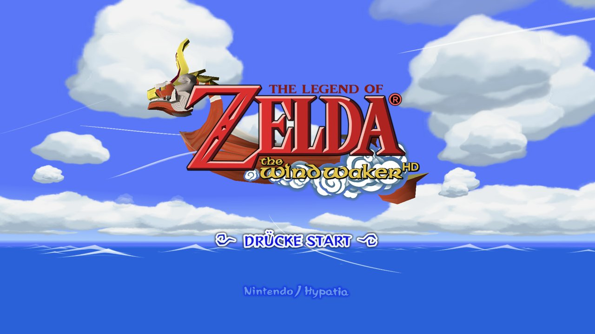

# BlueWake for Android

<p align="center">
  <strong>The Legend of Zelda: The Wind Waker, running natively on Android.</strong><br>
  A static recompilation of the GameCube original for arm64 phones and handhelds, with touch controls,
  controller support, mods and the game in five languages.
</p>

<p align="center">
  
  
  
  
  
</p>



> [!IMPORTANT]
> **Bring your own disc, build your own app.** This fork needs your own legally obtained copy of
> *The Wind Waker* for GameCube, USA version (`GZLE01`, revision 0). It contains no disc image, game
> assets or saves. The APK you build holds code translated from your disc: **it is yours alone; never
> share or upload it.**

This is the Android port of [BlueWake](https://github.com/chrissotraidis/bluewake). It plays the same
game the same way as BlueWake on iPhone, iPad, Mac and Windows: the same translator, the same pinned
runtime and the same verified game source, only built for arm64 Android, drawn through Vulkan and played
with a touch overlay or a controller. **For iPhone, iPad, Mac or Windows, use
[BlueWake itself](https://github.com/chrissotraidis/bluewake).**

## What works

Tested so far:

| Device | What was checked |
| --- | --- |
| **Samsung Galaxy Z Fold 7** (Snapdragon 8 Elite, Android 16) | Boot, title, a new file, the prologue and play on Outset, with touch controls, on both screens. 30 FPS while the phone stays cool (see [performance](docs/ANDROID.md#status)) |
| **AYN Odin3** (Snapdragon 8 Elite, Android 15, 16 KB pages) | Title, file select and play on Outset from a save made on the device, Hypatia's HD texture pack, FullHD 16:9 and 4:3 at 120 Hz, and the game in German, French, Spanish and Italian |
| iPlay60 mini Turbo (Android 14) | The app itself starts (no game module on it yet) |

Not yet tried: other GPUs (Mali, older Adreno), external controllers in depth, and the later game. If you
try it on another device, please report how it went (see [Getting help](#getting-help)).

**Features**

- **Touch controls**: stick, A/B/X/Y, L/R/Z, START and a D-pad, with the camera on the right half of the
  screen. They hide while a controller is connected.
- **Controllers** through SDL, as a GameCube pad, with button remapping.
- **Options menu** on the Back button or gesture, over the paused game: aspect ratio (4:3, 16:10, 16:9),
  render resolution up to 4× (with **2.25×, exactly 1080p** at 16:9), the panel's **60 or 120 Hz**,
  Smooth Motion, an HD texture pack (Hypatia's downloads from the menu), Better Wind Waker, gameplay
  extras and controls.
- **The game in German, French, Spanish or Italian** from your European disc, built in the app as the
  game loads: see [Other languages](#other-languages).

## What you need

- A PC to build on. The builder (`scripts/android/build.py`) runs on **Windows**, with Visual Studio's C++
  tools and clang, Python 3.10+, Git and CMake; it uses the Windows side of BlueWake's pipeline for the
  translator and the disc extractor.
- The Android SDK with the NDK (r27 or newer) and a JDK 17
- An **arm64 Android device on Android 13 (API 33) or newer** with Vulkan
- Your **`GZLE01` revision 0** disc image as `.iso` (convert an `.rvz` with Dolphin first:
  `DolphinTool convert -i GAME.rvz -o GZLE01.iso -f iso`)
- Optionally, your **European disc** (`GZLP01`) for the other languages

The full list, every builder option and the on-device optimization training are in
[BlueWake on Android](docs/ANDROID.md).

## Build and install

```bash
python scripts/android/build.py PATH/TO/GZLE01.iso --llvm PATH/TO/llvm --sdk PATH/TO/android-sdk --jdk PATH/TO/jdk-17
```

This translates the game from your disc and builds `build/android/WindWakerRecomp.apk` (the game module's
compile alone takes about half an hour on a fast PC; `--device SERIAL` also trains it on your device for more
speed).

Then, on your device:

1. Copy the APK and your disc image (`.iso` or `.gcm`) to the device, and install the APK.
2. Start the app and tap **Choose your disc image**. The app copies the disc into its own folder (1.4 GB),
   checks that it is the USA revision 0, prepares the game from it and starts it. Your file stays where it was.
3. Optionally, **Choose your European disc image** for the other languages (also later, from the options menu).

With a PC and adb, `python scripts/android/install.py --launch` does the same in one step (`--pal GZLP01.iso`
adds the European disc).

## Play

- **Options:** press Back (or swipe back, or a controller's Back/Select). Changes marked "next launch"
  apply when the game starts again.
- **Frame rate:** the game runs at 30 FPS, its own rate. On a phone, heat lowers the CPU's clocks, so the
  default is the power-saving choice: a 60 Hz panel, Smooth Motion off, twice the GameCube's resolution.
  Handhelds with active cooling can afford more: 2.25× and 120 Hz with Smooth Motion.
- **HD textures:** **Options › Display › Download Hypatia's HD pack** fetches
  [Hypatia's Wind Waker HD pack](https://forums.dolphin-emu.org/Thread-hypatia-s-tloz-the-wind-waker-hd-pack-v2-0001a)
  (v2.0001a, its Android-Lite build, 500 MB) from the download link in its Dolphin forum thread, unpacks it
  on the device (530 MB) and selects it; it is used from the next launch. The pack is not part of this app
  or this repository. Any other Dolphin pack works by hand: copy its `GZL` folder to
  `files/Load/Textures/GZLE01/GZL` and enter that `GZLE01` folder under **HD texture pack**.

### Other languages

The game is translated from the USA disc, whose text is English only. With your European disc beside it,
choose **Options › Gameplay › Language** and start the game again: the app reads that language's files
from the European disc as the game loads (about 2 MB, nothing is copied or changed) and plays in German,
French, Spanish or Italian, with the messages, the title logo, place names, the button words, the menus and
the file select translated.

Two things stay English: the name-entry keyboard and "New Game" on an empty file. If the European disc is
missing or not the right one, the game plays in English and the menu says why. Details:
[Other languages](docs/ANDROID.md#other-languages).

## Your saves and files

Everything lives in the app's folder, `/sdcard/Android/data/dev.bluewake.BlueWake/files`, reachable over
adb or a file manager that can open `Android/data`:

| | |
| --- | --- |
| `GZLE01.card` | your saves (the memory card) |
| `settings.ini` | the options menu's choices |
| `game/` | what the game reads from your discs |
| `logs/session-*.log` | the newest eight sessions; attach one to a bug report |

**Uninstalling the app deletes this folder, saves included.** Back them up first with
`python scripts/android/install.py --pull-saves backup/`. Installing a new build over the old one keeps
them.

## Getting help

- **Android problems:** open an issue on [this fork](https://github.com/zwaetschge/bluewake-android/issues).
  Say which device and Android version, where in the game it happened, and attach the session log. Please
  don't attach game files, disc images or APKs.
- **The game itself** (on every platform): BlueWake's
  [issues](https://github.com/chrissotraidis/bluewake/issues) and its
  [Discord](https://discord.gg/xwHfUD2bxW).

## Frequently asked questions

<details>
<summary><strong>Can I download an APK?</strong></summary>

No. The APK holds code translated from a Wind Waker disc, so everyone builds their own from their own disc,
and never shares it. The source and the build scripts are all here.

</details>

<details>
<summary><strong>Which version of the game works?</strong></summary>

Only the GameCube USA release, `GZLE01` revision 0: the game code is translated from it, and the builder
checks the disc. The European disc (`GZLP01`) is used only as the source of the other languages; it cannot
replace the USA disc.

</details>

<details>
<summary><strong>Is this an emulator?</strong></summary>

Not in the usual sense. The game's PowerPC code (the main program and all 415 of its modules) is
translated into native arm64 code ahead of time, on your PC. Nothing is compiled while you play, so it needs
no JIT. The hardware around the CPU (graphics, audio, memory card, timing) comes from a runtime derived from
[Dolphin](https://dolphin-emu.org/).

</details>

<details>
<summary><strong>The game slows down after a while on my phone</strong></summary>

That is the phone's thermal limit lowering the CPU's clocks as it warms, not the game: on the Fold 7 the game
holds 30 FPS below about 38 °C and drops to about 21 FPS at 43 °C. A lower render resolution, a 60 Hz panel,
Smooth Motion off and playing unplugged keep it cooler for longer.

</details>

<details>
<summary><strong>Does the Tingle Tuner work?</strong></summary>

No. It needs a Game Boy Advance linked to the GameCube, which is not emulated. Better Wind Waker's
**Tingle Chests without the Tingle Tuner** (on by default) opens Tingle Chests with ordinary bombs.

</details>

## How this fork is kept up to date

`main` mirrors [BlueWake](https://github.com/chrissotraidis/bluewake)'s `main`; the Android port lives on
the `android-port` branch, rebased onto each new BlueWake release. Most of the port is its own files
(`android/`, `scripts/android/`, `docs/ANDROID.md`); in shared code it changes little: the options menu's
Android entries, `cmake/composite`'s extra sources for training builds, and an optional parameter of the
Windows builder's job sizing. The language overlay wraps the runtime's disc layer at link time, so the
pinned runtime (RecompCore) is unchanged.

## Documentation

- [BlueWake on Android](docs/ANDROID.md): building, installing, options, performance, other languages
- [Mods](docs/MODS.md) and [Wind Waker HD textures](docs/WWHD_TEXTURES.md)
- [The Builder](docs/BUILDER.md): how the build works
- BlueWake's own guides for its other platforms: [iPhone, iPad and Mac](docs/BUILD_YOUR_OWN.md) and
  [Windows](docs/WINDOWS.md)
- [Legal and provenance](docs/research/LEGAL_AND_PROVENANCE.md)

## Credits

- [Chris Sotraidis](https://github.com/chrissotraidis) and [Elliott (@elliotttate)](https://github.com/elliotttate),
  who make [BlueWake](https://github.com/chrissotraidis/bluewake) and
  [Wind Waker Recomp](https://github.com/elliotttate/Wind-Waker-Recomp): everything this port runs
- [Kevin Good (@LiquidAzir)](https://github.com/LiquidAzir), whose Android port for Wind Waker Recomp
  ([elliotttate/Wind-Waker-Recomp#13](https://github.com/elliotttate/Wind-Waker-Recomp/pull/13)) this
  fork started from, and who brought it up on the Galaxy Z Fold 7
- [Dolphin](https://dolphin-emu.org/), for the compatibility runtime, DSP audio, the texture-pack format and
  the widescreen code
- [RecompCore](https://github.com/chrissotraidis/RecompCore) and
  [DolRecomp](https://github.com/chrissotraidis/DolRecomp), with the Aurora renderer, Dawn and SDL3
- [SunPad](https://github.com/chrissotraidis/sunpad), whose touch controls BlueWake adapts
- [zeldaret/tww](https://github.com/zeldaret/tww), the Wind Waker decompilation, for research
- [Better Wind Waker](https://github.com/WideBoner/betterww) by WideBoner, and the HD texture pack authors,
  including [Hypatia](https://forums.dolphin-emu.org/Thread-hypatia-s-tloz-the-wind-waker-hd-pack-v2-0001a)

Like BlueWake, this port is developed with substantial AI assistance for code, testing, documentation and
debugging; [docs/ANDROID.md](docs/ANDROID.md) records what was checked, and on what.

## License and legal

Licensed under the [GNU GPL, version 3 or later](LICENSE), as BlueWake is. See
[RIGHTS_AND_LICENSES.md](RIGHTS_AND_LICENSES.md) for details and for game content.

This is an independent fan project, not affiliated with or endorsed by Nintendo. *The Legend of Zelda*,
*The Wind Waker* and GameCube are trademarks of Nintendo. You need your own legally obtained discs and are
responsible for following the laws that apply to them.
